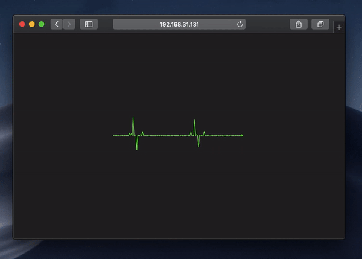
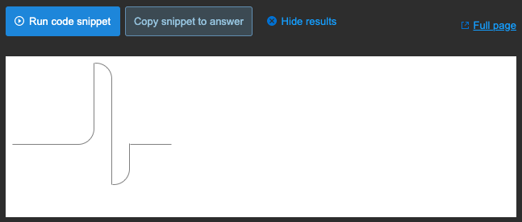

# ecg-line-webcomponent

> ECG line canvas wrapped with webcomponent

An easy-to-use web component which drawing an electrocardiogram on canvas. It also can be easy paired with [web bluetooth api](https://webbluetoothcg.github.io/web-bluetooth/#introduction-examples) to display heartrate from remote device in realtime (check `bang()` in callback)

Tribute to an an unknown developer who tried but [did not make it](https://stackoverflow.com/questions/40014999/animate-ecg-pulse-line-builded-with-border-and-border-radius)...

